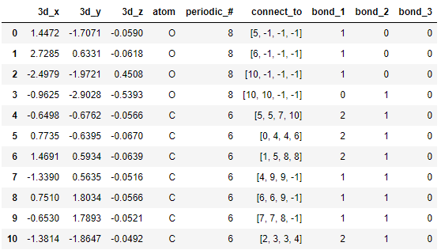

# OptiMol


[](https://travis-ci.org/github/ng-git/OptiMol)
[](https://coveralls.io/github/ng-git/OptiMol?branch=master)
[](https://opensource.org/licenses/MIT)

OptiMol is a package for predicting molecular conformations of organic compounds, currently limited to 4 most common elements, C, H, N, O.  There are four major components in this package: a data scrapping module, a data cleaning module, a machine learning module and  a visualization module.


## Table of Contents


- [Organization of the  project](#Organization-of-the-project)
- [Software Dependencies](#Software-Dependencies)
- [Project Data](#Project-Data)
- [Documentation](#Documentation)
- [Installation](#Installation)
- [Demo](#Demo)
- [Licensing](#Licensing)


## Organization of the  project

The project has the following structure:

    OptiMol/
      |- optimol/
        |- __init__.py
        |- data_compile.py
        |- model.py
        |- id.csv
        |- model.csv
        |- database_chemspider/
        |- tests/
        	|- __init__.py
            |- test_data_compile.py
      |- doc/
        |- component_specifications.ipynb
        |- functional_specifications.ipynb
        |- technology review.pdf
        |- final presentation.pdf
      |- demo/
        |- demo.ipynb
      |- README.md
      |- requirements.txt
      |- setup.py
      |- OptiMol.yml
      |- .travis.yml
      |- .gitignore
      |- LICENSE
      

The core script is `optimol/data_compile.py`. This file provides function that converts scrapped data (e.g. .mol or .txt ) into feed-able data frames for the machine learning model. For a more specific overview of the project, please see the `final presentaion` under `docs`.

We use [XGBoost]([https://xgboost.readthedocs.io/en/latest/](https://xgboost.readthedocs.io/en/latest/)) for the machine learning module. The Gradient boost tree is an ensemble technique where new models are added to correct the errors made by existing models. It optimizes the loss function to increase accuracy.

## Software Dependencies

- Python3
- For python packages see `requirements.txt` or use `OptiMol.yml` to create an environment for this package

## Project Data

Training data is stored in `/optimol/database_chemspider` [ChemSpider](http://www.chemspider.com/), where 2D&3D structures of each molecule are stored in .txt, respectively. You can also download the database from [here](https://drive.google.com/open?id=17vfuY6pkMiZzqaDvUiW3Zl7S7d0hAw22).

We strongly recommend name them in the form of `chemID_2d.txt` and `chemID_3d.txt` to be better processed by this module.

## Documentation

`optimol/data_compile.py`

This module contain functions to retrieve and process data from the database folder. Below shows how to use this module. 

```
from optimol import * 				# import module
data_compile.get_df_database(18) 	# loading file according their chemID, 18 here
```

This function will read the 2D&3D molecule files from database and generates 4 data frames: 2D atom coordination, 2D atom connection, 3D atom coordination and 3D atom connection. Then we merge them into two new data frame that can be applied in machine learning module.

```
data_compile.get_df_database(18)[2]  # return the new dataframe from 3D
```

Output:



The columns `3d_x`, `3d_y` and `3d_z` are the x, y ,z coordinates of atoms

`atom` stands for the atom type, while `periodic_#` stands for their periodic numbers

`connect_to` stands for what other atoms -- labelled in row index-- the current atom is connected to, and -1 stands for any connection to hydrogen atom

`bond_1`, `bond_2` and `bond_3` stands for the numbers of single, double and triple bonds that the atom has.

Atoms information of 2D molecules can be interpreted similarly as above.

See `functional_specifications` for module performance and use cases. Detailed description of each function are listed in `conponent_specifications`.

## Installation

Below are the steps to install this package:

1. Clone this repo to the computer: `git clone https://github.com/ng-git/OptiMol`

2. In the repo directory install and the environment:
```
conda env create -f OptiMol
conda activate OptiMol
```
Optional. `conda update conda` may be needed if packages were not found

## Demo

Once the intallation is completed, `optimol` package is ready to be used

1. Load the package and model
```
import pandas as pd
from optimol import data_compile
from optimol import model
    
# create model
model.buil_model()
```
2. Read the user input
```    
user_input = data_compile.get_df_user('./user.txt')
```
3. Train the model using the default data set
```
data = model.get_csv()
estimator = model.get_model(data)
```    
4. Input user data to model and get the result 
```
result = model.predict_3d(user_input,estimator)
``` 
   
For more information, please see examples listed in [jupyter notebook](https://jupyter.org/) under `demo`.

## Licensing

We use the MIT license to maintains copyright to the authors.
